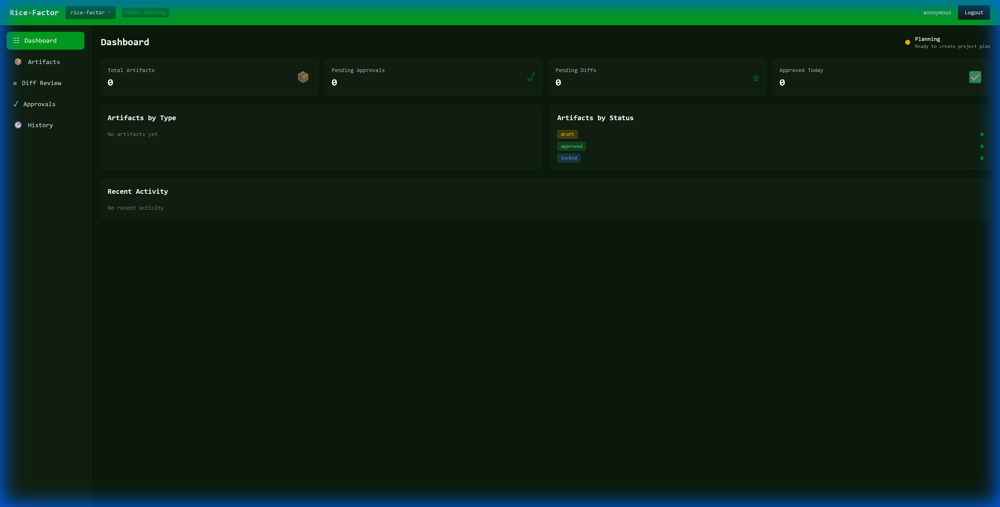
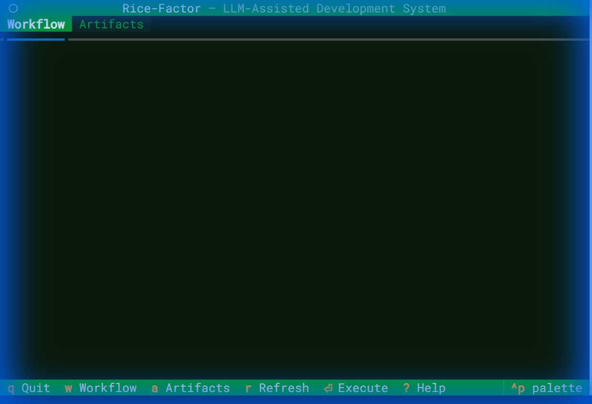

<p align="center">
  
</p>

<p align="center">
  <a href="https://www.python.org/"></a>
  <a href="LICENSE.md"></a>
  
  
</p>

<h3 align="center">LLM-Assisted Development System</h3>
<p align="center"><em>Treating LLMs as compilers, artifacts as intermediate representations</em></p>

---

## What is Rice-Factor?

Rice-Factor is a **language-agnostic, LLM-assisted software development system** that fundamentally changes how you use AI for coding. Instead of treating LLMs as chat assistants that write code directly, Rice-Factor treats them as **compilers** that generate structured plan artifacts.

### Key Differentiators

| Traditional AI Coding | Rice-Factor |
|----------------------|-------------|
| LLM writes code directly | LLM generates JSON plans |
| Unpredictable outputs | Deterministic, validated artifacts |
| No audit trail | Full replay and rollback capability |
| Human reviews code | Human approves plans before execution |
| Tests optional | Tests locked before implementation (TDD enforced) |

### Core Philosophy

- **LLMs as compilers** - Generate structured plans (JSON), not raw code
- **Artifacts as IR** - Plans are first-class intermediate representations
- **Tests as immutable law** - TestPlan is locked and never modified by automation
- **Humans as architects** - Approval required at all irreversible boundaries

---

## Demo

<!-- GIF demo will be generated with VHS -->
<!--  -->

```bash
# Quick workflow preview
$ rice-factor init                    # Initialize project
$ rice-factor plan project            # Generate ProjectPlan artifact
$ rice-factor scaffold                # Create file structure
$ rice-factor plan tests              # Generate TestPlan
$ rice-factor lock tests              # Lock tests (immutable)
$ rice-factor plan impl src/user.py   # Plan implementation
$ rice-factor impl src/user.py        # Generate diff
$ rice-factor apply                   # Apply approved changes
$ rice-factor test                    # Verify tests pass
```

---

## Features

### Core Workflow
- **Artifact-Driven Development** - All changes flow through validated JSON artifacts
- **System-Level TDD** - Tests are locked before any implementation begins
- **Human Approval Gates** - Irreversible operations require explicit approval
- **Full Audit Trail** - Every action is logged and replayable

### LLM Integration
- **Multiple Providers** - Claude, OpenAI, Ollama, vLLM, and more
- **Deterministic Output** - Temperature and sampling tuned for reproducibility
- **Cost Tracking** - Monitor token usage and costs per operation
- **Rate Limiting** - Built-in protection against API abuse

### Developer Experience
- **30 CLI Commands** - Comprehensive tooling for the full development lifecycle
- **TUI Mode** - Interactive terminal interface for workflow navigation
- **Web Dashboard** - Browser-based artifact review and approval
- **VS Code Extension** - IDE integration for seamless development

### Enterprise Ready
- **CI/CD Integration** - Pipeline validation and invariant enforcement
- **Multi-Agent Coordination** - Solo, orchestrator, voting, and hybrid modes
- **Remote Storage** - S3 and GCS backends for artifact persistence
- **Webhooks** - Slack, Teams, and custom notifications

---

## Quick Start

### Installation

```bash
# Using uv (recommended)
uv pip install rice-factor

# Or using pip
pip install rice-factor

# Verify installation
rice-factor --version
```

### 1. The Web Dashboard

Rice-Factor provides a modern web interface for managing artifacts and reviews:



### 2. The CLI Workflow

Start by initializing a new project:

```bash
rice-factor init
```


*(Note: Generate this demo using `vhs docs/assets/demos/demo.tape`)*

### 3. The TUI Dashboard

For terminal purists, a TUI is also available:



### Your First Project

```bash
# 1. Initialize a new Rice-Factor project
rice-factor init

# 2. Generate a project plan
rice-factor plan project

# 3. Approve the plan
rice-factor approve <artifact-id>

# 4. Create the file scaffolding
rice-factor scaffold

# 5. Generate and lock your tests
rice-factor plan tests
rice-factor approve <test-plan-id>
rice-factor lock tests

# 6. Implement a file
rice-factor plan impl src/main.py
rice-factor impl src/main.py
rice-factor review
rice-factor apply

# 7. Run tests
rice-factor test
```

---

## Usage

### Command Overview

| Command | Description |
|---------|-------------|
| `init` | Initialize a new Rice-Factor project |
| `plan project` | Generate a ProjectPlan artifact |
| `plan architecture` | Generate an ArchitecturePlan |
| `plan tests` | Generate a TestPlan |
| `plan impl <file>` | Generate an ImplementationPlan |
| `plan refactor <goal>` | Generate a RefactorPlan |
| `scaffold` | Create file structure from ScaffoldPlan |
| `impl <file>` | Generate implementation diff |
| `apply` | Apply approved diffs |
| `test` | Run test suite |
| `approve <artifact>` | Approve an artifact |
| `lock tests` | Lock TestPlan (immutable) |
| `validate` | Run all validations |
| `tui` | Launch interactive TUI |
| `web serve` | Start web dashboard |

For full command reference, see [CLI Documentation](docs/reference/cli/commands.md).

---

## Configuration

Rice-Factor follows **12-Factor App** methodology:

```yaml
# .rice-factor.yaml
llm:
  provider: claude              # claude, openai, ollama, vllm
  model: claude-3-5-sonnet-20241022
  temperature: 0.0              # Must be 0.0-0.2 for determinism

execution:
  dry_run: false
  auto_approve: false

paths:
  artifacts_dir: .project/artifacts
  audit_dir: .project/audit
```

Environment variables: `RICE_LLM_PROVIDER`, `RICE_LLM_MODEL`, `ANTHROPIC_API_KEY`, etc.

See [Configuration Reference](docs/reference/configuration/settings.md) for all options.

---

## Architecture

Rice-Factor uses **hexagonal architecture** (ports & adapters) for maximum flexibility:

```
┌─────────────────────────────────────────────────────────────┐
│                      ENTRYPOINTS                            │
│              CLI (Typer) │ TUI (Textual) │ Web (FastAPI)    │
└─────────────────────────────────────────────────────────────┘
                              │
┌─────────────────────────────────────────────────────────────┐
│                        ADAPTERS                             │
│   LLM Adapters    │  Storage Adapters  │    Executors      │
│ (Claude, OpenAI,  │  (Filesystem, S3,  │ (Scaffold, Diff,  │
│  Ollama, vLLM)    │       GCS)         │    Refactor)      │
└─────────────────────────────────────────────────────────────┘
                              │
┌─────────────────────────────────────────────────────────────┐
│                    DOMAIN (Pure Python)                     │
│           Ports (Protocols)  │  Artifacts  │  Services      │
│              No external dependencies                       │
└─────────────────────────────────────────────────────────────┘
```

See [Architecture Documentation](docs/reference/architecture/overview.md) for details.

---

## Artifact System

Rice-Factor manages 9 artifact types through a strict lifecycle:

| Artifact | Purpose |
|----------|---------|
| **ProjectPlan** | Defines domains, modules, constraints |
| **ArchitecturePlan** | Dependency laws and layer rules |
| **ScaffoldPlan** | File structure to create |
| **TestPlan** | Test definitions (locked before impl) |
| **ImplementationPlan** | Steps to implement a file |
| **RefactorPlan** | Structural changes preserving behavior |
| **ValidationResult** | Test/lint/arch validation outcomes |
| **FailureReport** | Blocking failures requiring attention |
| **ReconciliationPlan** | Steps to resolve drift |

### Artifact Lifecycle

```
DRAFT → APPROVED → LOCKED (TestPlan only)
                 ↓
            EXECUTABLE
```

See [Artifact Reference](docs/reference/artifacts/overview.md) for schemas and details.

---

## Project Status

### Completed Milestones (22/22)

| Phase | Milestones | Status |
|-------|------------|--------|
| **MVP** | 01-07: Core architecture, artifacts, CLI, LLM, executors, validation | Complete |
| **Post-MVP** | 08-13: CI/CD, drift detection, lifecycle, intake, refactoring, multi-agent | Complete |
| **Advanced** | 14-22: Local LLM, production hardening, resilience, performance, DX, web | Complete |

### What's Working

- Full artifact lifecycle with approval gates
- Claude and OpenAI LLM providers
- Local LLM support (Ollama, vLLM)
- 30 CLI commands
- TUI and Web interfaces
- CI/CD pipeline integration
- Multi-agent coordination modes

---

## Documentation

| Guide | Description |
|-------|-------------|
| [Installation](docs/guides/getting-started/installation.md) | Complete installation guide |
| [First Project](docs/guides/getting-started/first-project.md) | Step-by-step tutorial |
| [Core Concepts](docs/guides/getting-started/concepts.md) | Understanding Rice-Factor |
| [CLI Reference](docs/reference/cli/commands.md) | All commands documented |
| [Configuration](docs/reference/configuration/settings.md) | All config options |
| [Architecture](docs/reference/architecture/overview.md) | System design deep-dive |
| [Web Interface](docs/guides/web-interface/overview.md) | Web Dashboard Manual |

---

## Contributing

We welcome contributions! See [CONTRIBUTING.md](CONTRIBUTING.md) for guidelines.

```bash
# Development setup
git clone https://github.com/moabualruz/rice-factor.git
cd rice-factor
uv venv && source .venv/bin/activate  # or .venv\Scripts\activate on Windows
uv pip install -e ".[dev]"
pytest
```

---

## License

This project is licensed under the **Creative Commons Attribution-NonCommercial-ShareAlike 4.0 International (CC BY-NC-SA 4.0)** license.

- **Non-commercial use**: Free to use, share, and adapt
- **Commercial use**: Requires a separate commercial license

See [LICENSE.md](LICENSE.md) for details. For commercial licensing inquiries, contact the maintainers.

---

## Seven Principles

1. **Artifacts over prompts** - Plans are first-class data structures
2. **Plans before code** - Never write code without a plan artifact
3. **Tests before implementation** - TDD enforced at system level
4. **No LLM writes to disk** - LLM only generates JSON plans
5. **All automation is replayable** - Everything is auditable and reversible
6. **Partial failure is acceptable; silent failure is not**
7. **Human approval is mandatory at all irreversible boundaries**

---

<p align="center">
  <sub>Built with the philosophy that AI should augment human judgment, not replace it.</sub>
</p>
