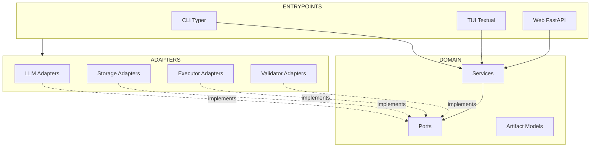

# Architecture Overview

Rice-Factor uses **Hexagonal Architecture** (Ports & Adapters) for clean separation of concerns and testability.

## Why Hexagonal Architecture?

### Benefits

| Benefit | Description |
|---------|-------------|
| **Testability** | Domain logic tested without external dependencies |
| **Flexibility** | Swap LLM providers, storage backends without code changes |
| **Maintainability** | Clear boundaries between layers |
| **Extensibility** | Add new adapters without touching core logic |

### Traditional vs Hexagonal

```
Traditional (Layered):
┌─────────────────────┐
│   Presentation      │
├─────────────────────┤
│   Business Logic    │  ← Depends on infrastructure
├─────────────────────┤
│   Data Access       │
└─────────────────────┘

Hexagonal:
┌─────────────────────────────────────────────┐
│              Entrypoints                    │
│         (CLI, TUI, Web, API)                │
├─────────────────────────────────────────────┤
│              Adapters                       │
│    (LLM, Storage, Executor, Validator)      │
├─────────────────────────────────────────────┤
│               Domain                        │  ← NO external dependencies
│    (Ports, Services, Artifacts, Models)     │
└─────────────────────────────────────────────┘
```

---

## Architecture Diagram



---

## Layer Responsibilities

### Domain Layer (Innermost)

**Location:** `rice_factor/domain/`

**Purpose:** Core business logic with ZERO external dependencies.

**Contains:**
- **Ports** - Interface definitions (protocols)
- **Services** - Business logic orchestration
- **Artifacts** - Pydantic models for all artifact types
- **Failures** - Error/failure models

**Rules:**
- NO imports from `adapters/` or `entrypoints/`
- NO external libraries (stdlib only + Pydantic)
- All external integrations via ports

### Adapters Layer (Middle)

**Location:** `rice_factor/adapters/`

**Purpose:** Implement ports with concrete external integrations.

**Contains:**
- **LLM Adapters** - Claude, OpenAI, Ollama, vLLM
- **Storage Adapters** - Filesystem, S3
- **Executor Adapters** - Scaffold, Diff, Refactor
- **Validator Adapters** - Schema, Test, Lint

**Rules:**
- MUST implement a port from `domain/ports/`
- CAN import from `domain/`
- CAN use external libraries

### Entrypoints Layer (Outermost)

**Location:** `rice_factor/entrypoints/`

**Purpose:** Application entry points that wire everything together.

**Contains:**
- **CLI** - Typer commands
- **TUI** - Textual interface
- **Web** - FastAPI routes

**Rules:**
- CAN import from `domain/` and `adapters/`
- CAN use external libraries
- Responsible for dependency injection

---

## Directory Structure

```
rice_factor/
├── domain/                      # DOMAIN LAYER
│   ├── __init__.py
│   ├── artifacts/               # Artifact models
│   │   ├── __init__.py
│   │   ├── envelope.py          # ArtifactEnvelope
│   │   ├── payloads.py          # All payload types
│   │   └── enums.py             # Status, Type enums
│   ├── ports/                   # Port definitions
│   │   ├── __init__.py
│   │   ├── llm.py               # LLMPort protocol
│   │   ├── storage.py           # StoragePort protocol
│   │   ├── executor.py          # ExecutorPort protocol
│   │   └── validator.py         # ValidatorPort protocol
│   ├── services/                # Domain services
│   │   ├── __init__.py
│   │   ├── artifact_service.py  # Artifact lifecycle
│   │   ├── plan_service.py      # Plan generation
│   │   └── executor_service.py  # Execution orchestration
│   └── failures/                # Failure models
│       ├── __init__.py
│       └── models.py            # FailureReport, etc.
│
├── adapters/                    # ADAPTERS LAYER
│   ├── __init__.py
│   ├── llm/                     # LLM adapters
│   │   ├── __init__.py
│   │   ├── claude.py            # Claude adapter
│   │   ├── openai.py            # OpenAI adapter
│   │   ├── ollama.py            # Ollama adapter
│   │   └── vllm.py              # vLLM adapter
│   ├── storage/                 # Storage adapters
│   │   ├── __init__.py
│   │   ├── filesystem.py        # Local filesystem
│   │   └── s3.py                # AWS S3
│   ├── executors/               # Executor adapters
│   │   ├── __init__.py
│   │   ├── scaffold.py          # File scaffolding
│   │   ├── diff.py              # Diff generation/apply
│   │   └── refactor.py          # Refactoring operations
│   └── validators/              # Validator adapters
│       ├── __init__.py
│       ├── schema.py            # JSON Schema validation
│       ├── test_runner.py       # Test execution
│       └── lint.py              # Linting
│
├── entrypoints/                 # ENTRYPOINTS LAYER
│   ├── __init__.py
│   ├── cli/                     # CLI entrypoint
│   │   ├── __init__.py
│   │   ├── main.py              # `rice-factor` command
│   │   └── commands/            # Subcommands
│   │       ├── __init__.py
│   │       ├── init.py
│   │       ├── plan.py
│   │       ├── scaffold.py
│   │       └── ...
│   ├── tui/                     # TUI entrypoint
│   │   ├── __init__.py
│   │   └── app.py               # Textual app
│   └── web/                     # Web entrypoint
│       ├── __init__.py
│       └── app.py               # FastAPI app
│
└── config/                      # Configuration
    ├── __init__.py
    ├── settings.py              # Dynaconf settings
    └── container.py             # Dependency injection
```

---

## Dependency Rules

### Import Constraints

```python
# ✓ ALLOWED: Domain imports stdlib
from datetime import datetime
from typing import Protocol

# ✗ FORBIDDEN: Domain imports external lib
from anthropic import Anthropic  # NO!

# ✓ ALLOWED: Adapters import domain
from rice_factor.domain.ports import LLMPort
from rice_factor.domain.artifacts import ArtifactEnvelope

# ✓ ALLOWED: Adapters import external libs
from anthropic import Anthropic

# ✓ ALLOWED: Entrypoints import everything
from rice_factor.domain.services import ArtifactService
from rice_factor.adapters.llm import ClaudeAdapter
import typer
```

### Visualization

```
┌─────────────────────────────────────────┐
│             ENTRYPOINTS                 │
│  Can import: domain, adapters, external │
└────────────────────┬────────────────────┘
                     │ imports
                     ▼
┌─────────────────────────────────────────┐
│              ADAPTERS                   │
│  Can import: domain, external           │
└────────────────────┬────────────────────┘
                     │ imports
                     ▼
┌─────────────────────────────────────────┐
│               DOMAIN                    │
│  Can import: stdlib only                │
└─────────────────────────────────────────┘
```

---

## Dependency Injection

Rice-Factor uses a simple DI container to wire adapters.

### Container Configuration

```python
# rice_factor/config/container.py
from rice_factor.domain.ports import LLMPort, StoragePort
from rice_factor.adapters.llm import ClaudeAdapter, OpenAIAdapter
from rice_factor.adapters.storage import FilesystemAdapter

class Container:
    def __init__(self, settings: Settings):
        self.settings = settings

    def get_llm(self) -> LLMPort:
        provider = self.settings.llm.provider
        if provider == "claude":
            return ClaudeAdapter(api_key=self.settings.llm.api_key)
        elif provider == "openai":
            return OpenAIAdapter(api_key=self.settings.llm.api_key)
        # ... other providers

    def get_storage(self) -> StoragePort:
        return FilesystemAdapter(base_path=self.settings.project_path)
```

### Usage in Entrypoints

```python
# rice_factor/entrypoints/cli/commands/plan.py
from rice_factor.config.container import Container
from rice_factor.domain.services import PlanService

@app.command()
def project():
    container = Container(settings)
    llm = container.get_llm()
    storage = container.get_storage()

    plan_service = PlanService(llm=llm, storage=storage)
    artifact = plan_service.generate_project_plan()
```

---

## Testing Strategy

### Unit Tests (Domain)

Test domain logic in isolation:

```python
# tests/domain/test_artifact_service.py
from rice_factor.domain.services import ArtifactService
from tests.mocks import MockStorage

def test_approve_draft_artifact():
    storage = MockStorage()
    service = ArtifactService(storage=storage)

    artifact = service.create(...)
    approved = service.approve(artifact.id)

    assert approved.status == ArtifactStatus.APPROVED
```

### Integration Tests (Adapters)

Test adapters against real services:

```python
# tests/adapters/test_claude_adapter.py
import pytest
from rice_factor.adapters.llm import ClaudeAdapter

@pytest.mark.integration
def test_claude_generates_plan():
    adapter = ClaudeAdapter(api_key=os.environ["ANTHROPIC_API_KEY"])
    result = adapter.generate(prompt="Generate a project plan...")

    assert result is not None
```

### End-to-End Tests

Test full workflows:

```python
# tests/e2e/test_workflow.py
def test_full_workflow(tmp_path):
    # Initialize project
    result = runner.invoke(app, ["init"], cwd=tmp_path)
    assert result.exit_code == 0

    # Generate plan
    result = runner.invoke(app, ["plan", "project"], cwd=tmp_path)
    assert result.exit_code == 0
```

---

## See Also

- [Domain Layer](domain.md) - Ports, services, models
- [Adapters](adapters.md) - All adapter implementations
- [Extending Rice-Factor](extending.md) - Adding new adapters
- [Configuration](../configuration/settings.md) - DI configuration
